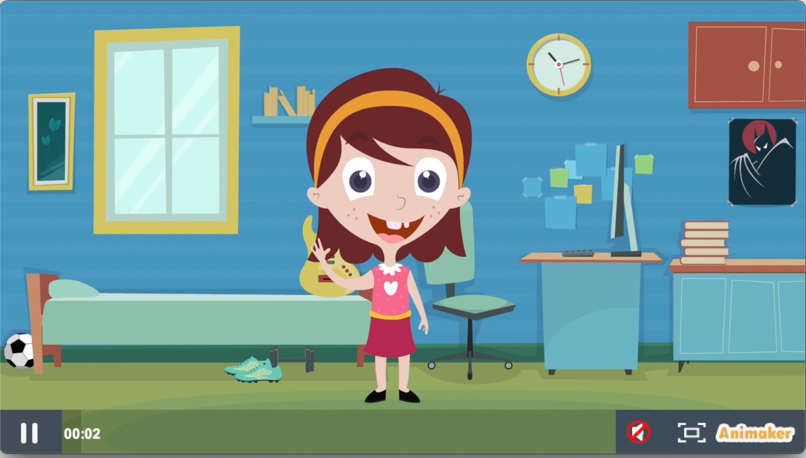

### About Oxford CCAI

On this page, you will find a series of research activities related to designing better AI for children, which is part of [Human Centred Computing](http://hcc.cs.ox.ac.uk) at the [Department of Computer Science](http://www.cs.ox.ac.uk) in the University of Oxford.

Currently **OxfordCCAI** focuses on the following research themes:
- creating new paradigm of digital parenting in the AI of age
- identifying age-appropriate AI algorithmic design patterns
- identifying ways to support developer to build age-appropriate AI applications

### New digital parenting

Are your parents always worried that you are spending too much time online or in front of screens? Do you and your parents always have to discuss how much time and when you are allowed to go online? And do some of them even use a parental control app or tool to control when you can go online and what you can do?

**KOALA Hero** allows parents and children to be more aware of the different third-party trackers that might be associated with the mobile apps that children are interacting with on their devices.

_Third-party trackers_ are widely observed on mobile apps, to carry out hidden data collection about user behaviour ('tracking'). Tracking is difficult to stop because there aren't many user-friendly apps or tools that users can use to detect and disable trackers. Furthermore, the harm of tracking seems intangile.

The goals of **KOALA Hero** are three fold:
- revealing the companies behind tracking and exposing the purposes of tracking, such as analytics or advertising，to increase family users' awareness about tracking
- enabling families and children to block tracking selectively; and
- collecting further user evidence to advocate more stringent policies against tracking on children's digital devices.

The development of KOALA Hero is informed by several different science research by the Oxford HCC researchers, including:
- an extensive tracker list developed from analysing ~2 000 000 apps;
- an extensive survey of current parental control support on the app market
- several years of empirical research about children's current awareness about tracking risks and their parents' approach for safeguarding them

While the project is under development, we are actively producing information in various formats to increase public awareness about _tracking_, some of which will also be made available in the KOALA Hero app upcoming.

This work is supported by Oxford University's Impact Accelerate Grant [KOALA;EP/R511742/1](https://koala.web.ox.ac.uk) and COVID Rebuild Grant.

### Developng AAAI for children

There seem to be a lot of dangers online; however, there are also lots of exciting opportunities. The good news is that researchers and scientists have learnt a lot about the risks and benefits of digital childhood in the last few years, and the UK government has launched several key new legal frameworks, to help keep children safe online.

Our Oxford researchers have also interviewed developers who build technologies for children, in order to understand how developers build technologies and what support they may need. 

We found a lot of challenges that developers are facing are actually related to gaps in the current government legal regulations, which define what grown-ups can or cannot do. These new UK laws are providing exciting new opportunities for future safer Internet. 

### New AAAI for children

AI systems are becoming increasingly pervasive within children's devices, apps, and services. However, it is not yet well-understood how risks and ethical considerations of AI relate to children. 

We reviewed 6 leading AI regulatory frameworks and identified age-appropriate design principles for children. We also conducted a literature review of 188 papers to understand how AI is applied to children. 

We identified that AI is widely used in _personalised tutor-ing/intervention, medical diagnosis, harms & safety, social robot-ics, personalised entertainment, public services, speech recognition, emotion recognition and age recognition_. However, most AI systems only address a small subset of the design principles required by the existing AI frameworks.  

### News

To support this year's Safer Internet Day, we prepared a 4-min short video to discuss less known online risks to children

To learn more about the science behind our advice, we pulled together a list below:

- **Data tracking risks**: ‘I make up a silly name': Understanding Children's Perception of Privacy Risks Online. Jun Zhao‚ Ge Wang‚ Carys Dally‚ Petr Slovak‚ Julian Childs‚ Max Van Klee and Nigel Shadbolt. In CHI Conference on Human Factors in Computing Systems Proceedings (CHI 2019)‚ May 4–9‚ 2019‚ Glasgow‚ Scotland Uk. 2019. [pdf](https://arxiv.org/abs/1901.10245)

- **Screentime control**: "I Just Want to Hack Myself to Not Get Distracted”: Evaluating Design Interventions for Self-Control on Facebook. Ulrik Lyngs, Kai Lukoff, Petr Slovak, William Seymour, Helena Webb, Marina Jirotka, Jun Zhao, Max Van Kleek, Nigel Shadbolt. CHI’20: ACM Conference on Human Factors in Computing Systems [pdf](https://arxiv.org/pdf/2001.04180.pdf)

- **Parental control**: Protection or punishment? relating the design space of parental control apps and perceptions about them to support parenting for online safety. G Wang, J Zhao, M Van Kleek, N Shadbolt. Proceedings of the Conference on Computer Supported Cooperative Work Conference. [pdf](https://ora.ox.ac.uk/objects/uuid:da71019d-157c-47de-a310-7e0340599e22)

- **Developing for children**: "Money makes the world go around": identifying barriers to better privacy in children’s apps from developers’ perspectives. Anirudh Ekambaranathan‚ Jun Zhao and Max Van Kleek. In Proceedings of the ACM Conference on Human Factors in Computing Systems. 2021. [pdf](https://ora.ox.ac.uk/objects/uuid:d124ee3e-f049-4d19-8b20-8ac33985635d/download_file?safe_filename=EkambaranathanetalAAM2021.pdf)

### Sister projects
- KOALA Hero: New site to be launched
- [Tracker Control](https://trackercontrol.org/)
- [Screen time control](https://redd-project.org/strategies/)
- [Oxford Human Centred Computing](https://hcc.cs.ox.ac.uk)

### Support or Contact

To get in touch please contact oxfordccai@cs.ox.ac.uk for more information.
