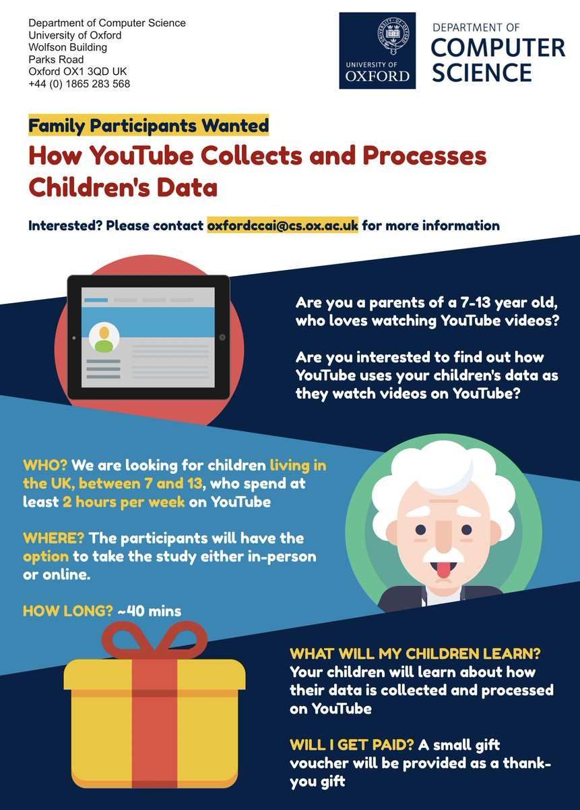

## Welcome to Oxford Child-Centred AI

### About Oxford CCAI

On this page, you will find a series of research activities related to designing better AI for children, which is part of [Human Centred Computing](http://hcc.cs.ox.ac.uk) at the [Department of Computer Science](http://www.cs.ox.ac.uk) in the University of Oxford.

Currently **OxfordCCAI** focuses on three main research and development themes:
- identifying age-appropriate AI algorithmic design patterns
- identifying age-appropriate ways to increase algorithmic transparecy for children
- identifying ways to support developer to build age-appropriate AI applications
- creating new paradigm of digital parenting in the AI of age

### News

Currently, we are actively recruiting families and children to join in our latest research study about children's perception of data-based algorithmics on YouTube systems. Join us to find out more! Please contact oxfordccai@cs.ox.ac.uk for more information.

### Publications

### Support or Contact

To get in touch please contact oxfordccai@cs.ox.ac.uk for more information.
